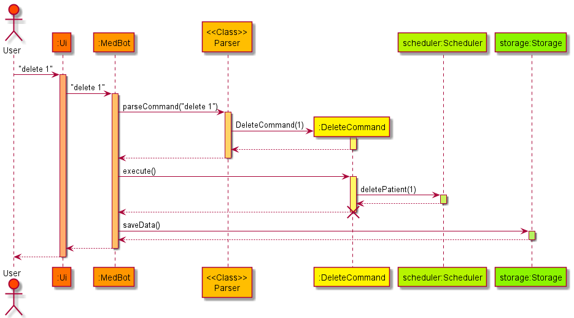

# Developer Guide

## Acknowledgements

Inspired by AB3's [Developer Guide](https://se-education.org/addressbook-level3/DeveloperGuide.html).

## Design

### Architecture

Given below is a quick overview of the main components of MedBot and how they interact with one another.

#### Main Components

The main class of MedBot is the `MedBot` class. It is responsible for initialising the other core components of MedBot
at application startup and for handling the interactions between these components.

The 4 core components of MedBot are:

* `Ui`: Handles the UI of MedBot.
* `Parser`: Parses user inputs and creates `Command` objects.
* `Scheduler`: Holds data in memory and contains the methods to read and write to it.
* `Storage`: Loads data from, and stores data to the hard disk.

In addition, the `Command` class facilitates the execution of user instructions.

#### Component Interaction

Given below is a sequence diagram of how the core components of MedBot interact with each other when the user inputs the
command `delete 1`.

### Ui Component

The Ui Component is handled by the `Ui` class. It is the main class that a user directly interacts with. This class is
responsible for reading user inputs and printing outputs to users.

The `Ui` class serves as an abstraction over these smaller classes:

* `PersonUi`: Handles the Ui for persons
    * `PatientUi`: Inherits `PersonUi` to handle patient-related Ui
    * `StaffUi`: Inherits `PersonUi` to handle staff-related Ui
* `SchedulerUi`: Handles the Ui for schedulers.

Given below is a sequence diagram of how the `Ui` component works after the `Parser`
parses `help delete` input given by a user.

### Parser Component

### Scheduler Component

### Storage Component

### Individual Commands

The Command class is responsible for handling the execution of user input.

Each individual Command object includes:

* `isExit()`: Return true only if it is an `ExitCommand` .
* `execute(Scheduler, Ui)`: Using the `Ui` class and data from the `Scheduler` to execute and print out the result to
  the user.
* Various attributes specific to the command, some common ones:
    * `id`: The id of `Person`/`Appointment` object to execute the command on.
    * `viewType`: The current `ViewType` of the program.

Given below is a class diagram of how the `Command` class and its subclasses are implemented.

## Implementation

This section describes some noteworthy details on how certain features are implemented.

### Switch view feature

#### Implementation

The switch view mechanism is heavily linked to the `Parser` class. By having a
`ViewType` enumeration property in `Parser`, the view of the console can be switched by executing the
appropriate `SwitchCommand` class, which modifies the corresponding `ViewType`
of the `Parser`. The 3 possible views and the corresponding user input commands are as follows:

* `switch patientinfo` - switches to the patient info view.
* `switch staffinfo` - switches to the medical staff info view.
* `switch scheduler` - switches to the scheduler view.
* `switch` - will switch to another view depending on the current view.

Each command essentially evokes the `Parser#setViewType(ViewType)` method, which will set the corresponding
`ViewType` property in the `Parser` class.

By having different views, we can execute different commands given the same user input. This will be demonstrated in the
example usage scenario below, and how the switch view mechanism works for different views.

<!--
Update with image + explanation
-->

#### Design Considerations

**Aspect: How different views are identified**

Currently, an enum property in the `Parser` class is used to differentiate between views.

Pros:

* Straightforward to implement

Cons:

* Maintainability concerns as complexity of Uis increase

#### Alternatives Considered

3 sub `Ui` classes & sub `Parser` classes that inherit from the main `Ui` and `Parser` class.

Pros:

* Potential for reduced coupling where only sub `Ui` or sub `Parser` classes affected by changes in other class

Cons:

* Less straightforward implementation

 

### Find feature

#### Functionality

This command will find a list of `Person` that match the given attributes in a table format.

#### Implementation

The `find` feature is facilitated by the `FindPersonCommand` class. It extends from `Command` class and overrides
the `execute()` method to achieve the desired functionality.

The example below gives a direction on how this command behaves.

Step 1.
 
A User execute the `find n/John` command. The `Parser#parseCommand()` method will parse this command and eventually
returns a `new FindPatientCommand()` object.

Step 2.
 
The `MedBot#interactWithUser()` method will run the `execute()` method in the `new FindPatientCommand()` object.

Step 3.
 
The `execute()` method will call `PersonList#findPersons()` method with the parameter `n/John` passed in.

Step 4.
 
`PersonList#findPersons()` will check all the `persons` list and returns all `Person` in the list whose name contains
the string `john`. The attribute match is case-insensitive.

Step 5.
 
The filtered `Person` list is then passed into the `Ui` class to be displayed into a table format through
`Ui#getFindPatientsMessage()`.

### Edit feature

#### Functionality

This command will edit a specified `Person` object with the attributes given in the command.

#### Implementation

The `edit` feature is facilitated by the `EditPersonCommand` class. It extends from `Command` class and overrides
the `execute()` method to achieve the desired functionality.

The example below gives a direction on how this command behaves.

Step 1.
 
A User execute the `edit n/John` command when the attribute `Parser#viewType` is `PATIENT_INFO`.
The `Parser#parseCommand()` method will parse this command and eventually returns a `new EditPatientCommand()` object.

Step 2.
 
The `MedBot#interactWithUser()` method will run the `execute()` method in the `new EditPatientCommand()` object.

Step 3.
 
The `execute()` method will call `PersonList#editPerson()` method with the new `Person` object having the parameter
`n/John` passed in. (All other attributes of the object are set to `null`)

Step 4.
 
`PersonList#editPerson()` will attempt to replace all attributes of the old `Person`
object with the non-null attributes given in the new `Person`.

Step 5.
 
The edited `Person` is then passed into the `Ui` class to be displayed through`Ui#getEditPatientMessage()`.

## Product scope

### Target user profile

{Describe the target user profile}

### Value proposition

{Describe the value proposition: what problem does it solve?}

1. Easily manage patient info, consultation requirements
2. Easily manage nurse/doctor schedules
3. Assign nurses/doctors to visit patients at specific times

## User Stories

|Version| As a ... | I want to ... | So that I can ...|
|--------|----------|---------------|------------------|
|v1.0|new user|see usage instructions|refer to them when I forget how to use the application|
|v2.0|user|find a to-do item by name|locate a to-do without having to go through the entire list|

## Non-Functional Requirements

{Give non-functional requirements}

## Glossary

* *glossary item* - Definition

## Instructions for manual testing

{Give instructions on how to do a manual product testing e.g., how to load sample data to be used for testing}
